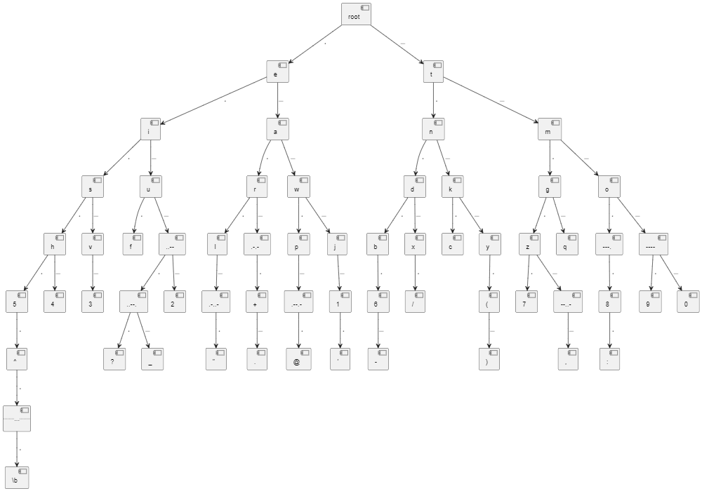

# CW_Keyboard

ESP32を使用してCW(モールス信号)のパドル信号をキーボード出力する。

## pin assign

- pin GPIO 12: PWM output
- pin GPIO 26: paddle Long input (pull up)
- pin GPIO 27: paddle short input (pull up)

## cw characters

